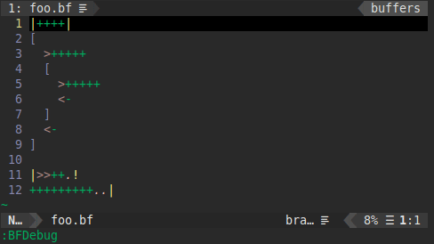

# brainfuck-vim
[中文](./README_CN.md)

A vim plugin for brainfuck programming language.

For an introduction to brainfuck, see https://www.muppetlabs.com/~breadbox/bf.



## Features
### Syntax Highlight
Including the basic commands (`><+-.,[]`), comments and two extra debugger only commands (`!|`).

### Interpreter
Execute `:BFRun` to run the interpreter with the current file as input.

The interpreter interprets the basic commands (`><+-.,[]`) and any other characters will be ignored.

Line comments start with non-command characters (except spaces) and any valid commands in the comments are also ignored.

The input and output field is at the bottom.
```
  +---------------------+
  |Brainfuck source code|
  |                     |
  |                     |
  |                     |
  |                     |
  +---------------------+
  |      IO field       |
  +---------------------+
```

For more features and configuration, see [General Configuration](#general-configuration).

### Debugger
Execute `:BFDebug` to run the debugger with the current file as input.

The debugger has all the features of the interpreter.

It supports two extra commands (which are ignored in the interpreter):
* `!`: Pause program execution. Press any key to continue.
* `|`: The commands between two `|` will be executed one by one.

It opens a debug buffer showing the status of the array.
```
  +---------------------+------------+
  |Brainfuck source code|Debug buffer|
  |                     |            |
  |                     |            |
  |                     |            |
  |                     |            |
  +---------------------+------------+
  |             IO field             |
  +---------------------+------------+
```

For more features and configuration, see [General Configuration](#general-configuration) and [Debugger Configuration](#debugger-configuration).

## Installation
### [vim-plug](https://github.com/junegunn/vim-plug/)
```vim
Plug 'fruit-in/brainfuck-vim'
```
```vim
:PlugInstall
```

### [Vundle.vim](https://github.com/VundleVim/Vundle.vim/)
```vim
Plugin 'fruit-in/brainfuck-vim'
```
```vim
:PluginInstall
```

## Configuration
You can customize the behavior of the interpreter and debugger by setting some variables in your `vimrc`. For example:
```vim
let g:bf_array_size = 3000
let g:bf_array_mode = 2
let g:bf_value_mode = 2
```

### General Configuration
#### Array Size
Set `g:bf_array_size` to set the size of the array.

Optional values are `> 0`. Default value is `30,000`.

#### Array Mode
Set `g:bf_array_mode` to define the behavior when the pointer exceeds the array boundary.

Optional values are `{0, 1, 2}`. Default value is `0`.
* `0`: Strict Mode. Throws an error when the pointer exceeds the array boundary.
* `1`: Normal Mode. Saturating at the boundary when the pointer exceeds the array boundary.
* `2`: Circular Mode. Wrapping around at the boundary when the pointer exceeds the array boundary.

#### Value Type
Set `g:bf_value_type` to set the type of the value.

Optional values are `{0, 1, 2, 3, 4, 5, 6}`. Default value is `0`.
* `0`: u8.
* `1`: i8.
* `2`: u16.
* `3`: i16.
* `4`: u32.
* `5`: i32.
* `6`: Customization. See [Value Max](#value-max) and [Value Min](#value-min).

#### Value Mode
Set `g:bf_value_mode` to define the behavior when the value exceeds the value boundary.

Optional values are `{0, 1, 2}`. Default value is `0`.
* `0`: Strict Mode. Throws an error when the value exceeds the value boundary.
* `1`: Normal Mode. Saturating at the boundary when the value exceeds the value boundary.
* `2`: Circular Mode. Wrapping around at the boundary when the value exceeds the value boundary.

#### Value Max
Set `g:bf_value_max` to set the upper bound of the value. Works only when `g:bf_value_type == 6`.

Optional values are `>= 0`. Default value is `255`.

#### Value Min
Set `g:bf_value_min` to set the lower bound of the value. Works only when `g:bf_value_type == 6`.

Optional values are `<= 0`. Default value is `0`.

### Debugger Configuration
#### Debug Delay
Set `g:bf_debug_delay` to set the time interval between executing commands, in milliseconds. Works only in the debugger and the commands between two `|`.

Optional values are `> 0`. Default value is `200`.
